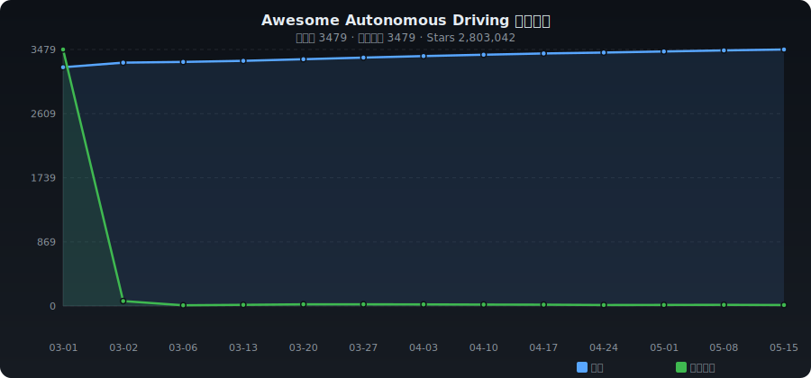

# ✨ Awesome Autonomous Driving

**English** | [中文](./README_ZH.md)

> Curated collection of Autonomous Driving — end-to-end, VLA, BEV perception, planning, world models & more

   

---

## 📈 Trends

---

## 📊 Category Stats

| Category | Count | Share |
|----------|------:|------:|
| 🏎️ End-to-End Driving | 157 | █ 4.6% |
| 🧠 VLA & Driving Foundation Models | 216 | ██ 6.3% |
| 🌍 World Models & Generation | 49 | █ 1.4% |
| 👁️ 3D Perception & BEV | 447 | ████ 13.1% |
| 🎨 Segmentation & Occupancy | 224 | ██ 6.6% |
| 📐 Motion Prediction & Planning | 155 | █ 4.5% |
| 🗺️ Mapping & Localization | 146 | █ 4.3% |
| 🎮 Simulation & Datasets | 687 | ██████ 20.2% |
| 🏗️ Open-source Platforms | 401 | ███ 11.8% |
| 📡 V2X & Connected Vehicles | 146 | █ 4.3% |
| 📷 Sensors & Fusion | 87 | █ 2.6% |
| 📦 Others | 693 | ██████ 20.3% |

---

## 🔥 Weekly Trending (2026-04-10)

| # | Project | ⭐ | 📈 Gain | Description |
|:-:|---------|---:|-------:|-------------|
| 1 | [OpenDCAI/OpenWorldLib](https://github.com/OpenDCAI/OpenWorldLib) | 569 | +244 | Unified Codebase for Advanced World Models. |
| 2 | [starVLA/starVLA](https://github.com/starVLA/starVLA) | 1,695 | +167 | StarVLA: A Lego-like Codebase for Vision-Language-Action Mod |
| 3 | [xiaomi-research/unidrivevla](https://github.com/xiaomi-research/unidrivevla) | 116 | +78 | UniDriveVLA: Unifying Understanding, Perception, and Action  |
| 4 | [AtsushiSakai/PythonRobotics](https://github.com/AtsushiSakai/PythonRobotics) | 29,114 | +63 | Python sample codes and textbook for robotics algorithms. |
| 5 | [commaai/openpilot](https://github.com/commaai/openpilot) | 60,559 | +51 | openpilot is an operating system for robotics. Currently, it |
| 6 | [jonyzhang2023/awesome-embodied-vla-va-vln](https://github.com/jonyzhang2023/awesome-embodied-vla-va-vln) | 2,910 | +46 | A curated list of state-of-the-art research in embodied AI,  |
| 7 | [MIV-XJTU/FSDrive](https://github.com/MIV-XJTU/FSDrive) | 704 | +42 | [NeurIPS 2025 spotlight] Official implementation for "Future |
| 8 | [carla-simulator/carla](https://github.com/carla-simulator/carla) | 13,830 | +41 | Open-source simulator for autonomous driving research. |
| 9 | [autowarefoundation/autoware](https://github.com/autowarefoundation/autoware) | 11,354 | +34 | Autoware - the world's leading open-source software project  |
| 10 | [autowarefoundation/autoware_vision_pilot](https://github.com/autowarefoundation/autoware_vision_pilot) | 467 | +30 | Free self-driving car stack - fully open-source ADAS and aut |
| 11 | [fudan-generative-vision/WAM-Flow](https://github.com/fudan-generative-vision/WAM-Flow) | 301 | +30 | [CVPR 2026] WAM-Flow: Parallel Coarse-to-Fine Motion Plannin |
| 12 | [valeoai/OccAny](https://github.com/valeoai/OccAny) | 82 | +29 | [CVPR 2026] OccAny: Generalized Unconstrained Urban 3D Occup |
| 13 | [fudan-generative-vision/WAM-Diff](https://github.com/fudan-generative-vision/WAM-Diff) | 264 | +27 | WAM-Diff: A Masked Diffusion VLA Framework with MoE and Onli |
| 14 | [leofan90/Awesome-World-Models](https://github.com/leofan90/Awesome-World-Models) | 1,465 | +26 | A comprehensive list of papers for the definition of World M |
| 15 | [emqx/emqx](https://github.com/emqx/emqx) | 16,137 | +23 | The most scalable and reliable MQTT broker for AI, IoT, IIoT |
| 16 | [LMD0311/Awesome-World-Model](https://github.com/LMD0311/Awesome-World-Model) | 1,970 | +22 | Collect some World Models for Autonomous Driving (and Roboti |
| 17 | [allenai/vla-evaluation-harness](https://github.com/allenai/vla-evaluation-harness) | 206 | +20 | One framework to evaluate any VLA model on any robot simulat |
| 18 | [AgibotTech/ACoT-VLA](https://github.com/AgibotTech/ACoT-VLA) | 128 | +18 | [CVPR 2026] Official implementation of "ACoT-VLA: Action Cha |
| 19 | [fundamentalvision/BEVFormer](https://github.com/fundamentalvision/BEVFormer) | 4,418 | +17 | [ECCV 2022] This is the official implementation of BEVFormer |
| 20 | [dexmal/dexbotic](https://github.com/dexmal/dexbotic) | 909 | +17 | Dexbotic: Open-Source Vision-Language-Action Toolbox |

---

## 📁 Categories

- [🏎️ End-to-End Driving](#e2e) (157)
- [🧠 VLA & Driving Foundation Models](#vla) (216)
- [🌍 World Models & Generation](#world-model) (49)
- [👁️ 3D Perception & BEV](#perception) (447)
- [🎨 Segmentation & Occupancy](#segmentation) (224)
- [📐 Motion Prediction & Planning](#prediction) (155)
- [🗺️ Mapping & Localization](#mapping) (146)
- [🎮 Simulation & Datasets](#simulation) (687)
- [🏗️ Open-source Platforms](#platform) (401)
- [📡 V2X & Connected Vehicles](#v2x) (146)
- [📷 Sensors & Fusion](#sensor) (87)
- [📦 Others](#other) (693)

---

### 🏎️ End-to-End Driving

| Project | ⭐ | Language | Description |
|---------|---:|:--------:|-------------|
| [mlflow/mlflow](https://github.com/mlflow/mlflow) | 24,485 | Python | The open source developer platform to build AI agents and models with  |
| [OpenDriveLab/End-to-end-Autonomous-Driving](https://github.com/OpenDriveLab/End-to-end-Autonomous-Driving) | 3,573 | - | [IEEE T-PAMI 2024] All you need for End-to-end Autonomous Driving |
| [showlab/ShowUI](https://github.com/showlab/ShowUI) | 1,772 | Python | [CVPR 2025] Open-source, End-to-end, Vision-Language-Action model for  |
| [autonomousvision/transfuser](https://github.com/autonomousvision/transfuser) | 1,537 | Python | [PAMI'23] TransFuser: Imitation with Transformer-Based Sensor Fusion f |
| [marsauto/europilot](https://github.com/marsauto/europilot) | 1,516 | Jupyter Notebook | A toolkit for controlling Euro Truck Simulator 2 with the end-to-end d |
| [hustvl/MapTR](https://github.com/hustvl/MapTR) | 1,485 | Python | [ICLR'23 Spotlight & ECCV'24 & IJCV'24] MapTR: Structured Modeling and |
| [hustvl/DiffusionDrive](https://github.com/hustvl/DiffusionDrive) | 1,347 | Python | [CVPR 2025 Highlight] Truncated Diffusion Model for Real-Time End-to-E |
| [hustvl/VAD](https://github.com/hustvl/VAD) | 1,281 | Python | [ICCV 2023 & ICLR 2026] VAD: Vectorized Scene Representation for Effic |
| [NVlabs/alpasim](https://github.com/NVlabs/alpasim) | 958 | Python | AlpaSim is an open-source autonomous vehicle simulation platform desig |
| [ZhengYinan-AIR/Diffusion-Planner](https://github.com/ZhengYinan-AIR/Diffusion-Planner) | 928 | Python | [ICLR 2025 Oral] The official implementation of "Diffusion-Based Plann |
| [swc-17/SparseDrive](https://github.com/swc-17/SparseDrive) | 906 | Python | SparseDrive: End-to-End Autonomous Driving via Sparse Scene Representa |
| [opendilab/LMDrive](https://github.com/opendilab/LMDrive) | 882 | Jupyter Notebook | [CVPR 2024] LMDrive: Closed-Loop End-to-End Driving with Large Languag |
| [datvuthanh/HybridNets](https://github.com/datvuthanh/HybridNets) | 673 | Python | HybridNets: End-to-End Perception Network |
| [wvangansbeke/LaneDetection_End2End](https://github.com/wvangansbeke/LaneDetection_End2End) | 664 | Python | End-to-end Lane Detection for Self-Driving Cars (ICCV 2019 Workshop) |
| [xiaomi-mlab/Orion](https://github.com/xiaomi-mlab/Orion) | 615 | Python | [ICCV 2025] Official code of "ORION: A Holistic End-to-End Autonomous  |
| [hustvl/Senna](https://github.com/hustvl/Senna) | 542 | Python | Bridging Large Vision-Language Models and End-to-End Autonomous Drivin |
| [autonomousvision/carla_garage](https://github.com/autonomousvision/carla_garage) | 526 | Python | [ICCV'23] Hidden Biases of End-to-End Driving Models & A starter kit f |
| [experiencor/self-driving-toy-car](https://github.com/experiencor/self-driving-toy-car) | 520 | Jupyter Notebook | A self driving toy car using end-to-end learning |
| [xiaomi-research/recogdrive](https://github.com/xiaomi-research/recogdrive) | 503 | Python | [ICLR 2026] ReCogDrive: A Reinforced Cognitive Framework for End-to-En |
| [opendilab/awesome-end-to-end-autonomous-driving](https://github.com/opendilab/awesome-end-to-end-autonomous-driving) | 490 | - | A curated list of awesome End-to-End Autonomous Driving resources (con |
| [wzzheng/GenAD](https://github.com/wzzheng/GenAD) | 481 | Python | [ECCV 2024] GenAD: Generative End-to-End Autonomous Driving |
| [chauvinSimon/My_Bibliography_for_Research_on_Autonomous_Driving](https://github.com/chauvinSimon/My_Bibliography_for_Research_on_Autonomous_Driving) | 467 | - | Personal notes about scientific and research works on "Decision-Making |
| [dotchen/LAV](https://github.com/dotchen/LAV) | 440 | Python | (CVPR 2022) A minimalist, mapless, end-to-end self-driving stack for j |
| [OpenDriveLab/ST-P3](https://github.com/OpenDriveLab/ST-P3) | 431 | Python | [ECCV 2022] ST-P3, an end-to-end vision-based autonomous driving frame |
| [zhejz/carla-roach](https://github.com/zhejz/carla-roach) | 388 | Python | Roach: End-to-End Urban Driving by Imitating a Reinforcement Learning  |
| [YvanYin/GoalFlow](https://github.com/YvanYin/GoalFlow) | 370 | Python | Repo of "GoalFlow: Goal-Driven Flow Matching for Multimodal Trajectori |
| [ucd-dare/CarDreamer](https://github.com/ucd-dare/CarDreamer) | 339 | Python | World Model based Autonomous Driving Platform in CARLA :car: |
| [dotchen/LearningByCheating](https://github.com/dotchen/LearningByCheating) | 335 | Python | (CoRL 2019) Driving in CARLA using waypoint prediction and two-stage i |
| [BraveGroup/LAW](https://github.com/BraveGroup/LAW) | 334 | Python | (ICLR2025) Enhancing End-to-End Autonomous Driving with Latent World M |
| [autonomousvision/neat](https://github.com/autonomousvision/neat) | 327 | Python | [ICCV'21] NEAT: Neural Attention Fields for End-to-End Autonomous Driv |
| [OpenDriveLab/Openpilot-Deepdive](https://github.com/OpenDriveLab/Openpilot-Deepdive) | 297 | Python | Our insights of Openpilot, a deepdive project on it |
| [cjy1992/interp-e2e-driving](https://github.com/cjy1992/interp-e2e-driving) | 294 | Python | Interpretable End-to-end Urban Autonomous Driving with Latent Deep Rei |
| [hustvl/DiffusionDriveV2](https://github.com/hustvl/DiffusionDriveV2) | 289 | Python | DiffusionDriveV2: Reinforcement Learning-Constrained Truncated Diffusi |
| [adept-thu/MomAD](https://github.com/adept-thu/MomAD) | 272 | Python | [CVPR2025] Don’t Shake the Wheel: Momentum-Aware Planning in End-to-En |
| [jmwang0117/HE-Drive](https://github.com/jmwang0117/HE-Drive) | 254 | Python | HE-Drive: Human-Like End-to-End Driving with Vision Language Models |
| [atonderski/neuro-ncap](https://github.com/atonderski/neuro-ncap) | 247 | Python | NeuroNCAP benchmark for end-to-end autonomous driving |
| [OpenDriveLab/DriveAdapter](https://github.com/OpenDriveLab/DriveAdapter) | 245 | Python | [ICCV 2023 Oral] A New Paradigm for End-to-end Autonomous Driving to A |
| [adept-thu/DIVER](https://github.com/adept-thu/DIVER) | 243 | Python | DIVER: Reinforced Diffusion Breaks Imitation Bottlenecks in End-to-End |
| [Pranav-chib/End-to-End-Autonomous-Driving](https://github.com/Pranav-chib/End-to-End-Autonomous-Driving) | 242 | - | A collection of recent resources on End-to-End Autonomous Driving [sur |
| [naokishibuya/car-behavioral-cloning](https://github.com/naokishibuya/car-behavioral-cloning) | 235 | Python | Built and trained a convolutional network for end-to-end driving in a  |

---

### 🧠 VLA & Driving Foundation Models

| Project | ⭐ | Language | Description |
|---------|---:|:--------:|-------------|
| [jonyzhang2023/awesome-embodied-vla-va-vln](https://github.com/jonyzhang2023/awesome-embodied-vla-va-vln) | 2,910 | - | A curated list of state-of-the-art research in embodied AI, focusing o |
| [open-gigaai/giga-brain-0](https://github.com/open-gigaai/giga-brain-0) | 2,466 | Python | GigaBrain-0: A World Model-Powered Vision-Language-Action Model |
| [OpenHelix-Team/VLA-Adapter](https://github.com/OpenHelix-Team/VLA-Adapter) | 2,097 | Python | VLA-Adapter: An Effective Paradigm for Tiny-Scale Vision-Language-Acti |
| [Thinklab-SJTU/Awesome-LLM4AD](https://github.com/Thinklab-SJTU/Awesome-LLM4AD) | 1,769 | - | A curated list of awesome LLM/VLM/VLA/World Model for Autonomous Drivi |
| [starVLA/starVLA](https://github.com/starVLA/starVLA) | 1,695 | Python | StarVLA: A Lego-like Codebase for Vision-Language-Action Model Develop |
| [allenzren/open-pi-zero](https://github.com/allenzren/open-pi-zero) | 1,444 | Python | Re-implementation of pi0 vision-language-action (VLA) model from Physi |
| [OpenDriveLab/DriveLM](https://github.com/OpenDriveLab/DriveLM) | 1,293 | HTML | [ECCV 2024 Oral] DriveLM: Driving with Graph Visual Question Answering |
| [NVlabs/VoxFormer](https://github.com/NVlabs/VoxFormer) | 1,186 | Python | Official PyTorch implementation of VoxFormer [CVPR 2023 Highlight] |
| [Robbyant/lingbot-vla](https://github.com/Robbyant/lingbot-vla) | 1,033 | Python | A Pragmatic VLA Foundation Model |
| [alibaba-damo-academy/RynnVLA-002](https://github.com/alibaba-damo-academy/RynnVLA-002) | 977 | Python | RynnVLA-002: A Unified Vision-Language-Action and World Model |
| [dexmal/dexbotic](https://github.com/dexmal/dexbotic) | 909 | Python | Dexbotic: Open-Source Vision-Language-Action Toolbox |
| [coderonion/awesome-llm-and-aigc](https://github.com/coderonion/awesome-llm-and-aigc) | 808 | - | 🚀🚀🚀A collection of some awesome public projects about Large Language M |
| [iLearn-Lab/VLA-Diffusion-Policy-Robotics](https://github.com/iLearn-Lab/VLA-Diffusion-Policy-Robotics) | 793 | - | Awesome collection of resources and papers on Diffusion Models for Rob |
| [EmbodiedMind/VLA-Diffusion-Policy-Robotics](https://github.com/EmbodiedMind/VLA-Diffusion-Policy-Robotics) | 787 | - | Awesome collection of resources and papers on Diffusion Models for Rob |
| [InternRobotics/InternNav](https://github.com/InternRobotics/InternNav) | 782 | Jupyter Notebook | InternRobotics' open platform for building generalized navigation foun |
| [MIV-XJTU/FSDrive](https://github.com/MIV-XJTU/FSDrive) | 704 | Python | [NeurIPS 2025 spotlight] Official implementation for "FutureSightDrive |
| [DriveVLA/OpenDriveVLA](https://github.com/DriveVLA/OpenDriveVLA) | 684 | Python | [AAAI 2026] OpenDriveVLA: Towards End-to-end Autonomous Driving with L |
| [SpatialVLA/SpatialVLA](https://github.com/SpatialVLA/SpatialVLA) | 677 | Python | 🔥 SpatialVLA: a spatial-enhanced vision-language-action model that is  |
| [NVlabs/EmerNeRF](https://github.com/NVlabs/EmerNeRF) | 639 | Python | PyTorch Implementation of EmerNeRF: Emergent Spatial-Temporal Scene De |
| [Denghaoyuan123/Awesome-RL-VLA](https://github.com/Denghaoyuan123/Awesome-RL-VLA) | 627 | - | A Survey on Reinforcement Learning of Vision-Language-Action Models fo |
| [UMass-Embodied-AGI/3D-VLA](https://github.com/UMass-Embodied-AGI/3D-VLA) | 619 | Python | [ICML 2024] 3D-VLA: A 3D Vision-Language-Action Generative World Model |
| [2toinf/X-VLA](https://github.com/2toinf/X-VLA) | 589 | C++ | [ICLR 2026] The offical Implementation of "Soft-Prompted Transformer a |
| [JohnsonJiang1996/Awesome-VLA4AD](https://github.com/JohnsonJiang1996/Awesome-VLA4AD) | 579 | - | Vision–Language–Action models for Autonomous Driving (VLA4AD) resource |
| [AnjieCheng/NaVILA](https://github.com/AnjieCheng/NaVILA) | 575 | Python | [RSS'25] This repository is the implementation of "NaVILA: Legged Robo |
| [Psi-Robot/Awesome-VLA-Papers](https://github.com/Psi-Robot/Awesome-VLA-Papers) | 509 | - | Paper list in the survey: A Survey on Vision-Language-Action Models: A |
| [OpenBMB/DeepThinkVLA](https://github.com/OpenBMB/DeepThinkVLA) | 506 | Python | DeepThinkVLA: Enhancing Reasoning Capability of Vision-Language-Action |
| [Jiaaqiliu/Awesome-VLA-Robotics](https://github.com/Jiaaqiliu/Awesome-VLA-Robotics) | 504 | - | A comprehensive list of excellent research papers, models, datasets, a |
| [Psi-Robot/DexGraspVLA](https://github.com/Psi-Robot/DexGraspVLA) | 500 | Python | [AAAI'26 Oral] DexGraspVLA: A Vision-Language-Action Framework Towards |
| [ucla-mobility/AutoVLA](https://github.com/ucla-mobility/AutoVLA) | 498 | Python | [NeurIPS 2025] AutoVLA: A Vision-Language-Action Model for End-to-End  |
| [OpenDriveLab/OpenScene](https://github.com/OpenDriveLab/OpenScene) | 428 | Python | 3D Occupancy Prediction Benchmark in Autonomous Driving |
| [GuanxingLu/vlarl](https://github.com/GuanxingLu/vlarl) | 418 | Python | Single-file implementation to advance vision-language-action (VLA) mod |
| [microsoft/CogACT](https://github.com/microsoft/CogACT) | 414 | Python | A Foundational Vision-Language-Action Model for Synergizing Cognition  |
| [InternRobotics/InternVLA-M1](https://github.com/InternRobotics/InternVLA-M1) | 396 | Python | InternVLA-M1: A Spatially Guided Vision-Language-Action Framework for  |
| [JiuTian-VL/Large-VLM-based-VLA-for-Robotic-Manipulation](https://github.com/JiuTian-VL/Large-VLM-based-VLA-for-Robotic-Manipulation) | 387 | - | A curated list of large VLM-based VLA models for robotic manipulation. |
| [RenzKa/simlingo](https://github.com/RenzKa/simlingo) | 386 | Python | [CVPR 2025, Spotlight] SimLingo (CarLLava): Vision-Only Closed-Loop Au |
| [worldbench/awesome-vla-for-ad](https://github.com/worldbench/awesome-vla-for-ad) | 368 | HTML | 🌐 Vision-Language-Action Models for Autonomous Driving: Past, Present, |
| [phospho-app/phosphobot](https://github.com/phospho-app/phosphobot) | 362 | Python | Control AI robots. Community-driven UI middleware for controlling robo |
| [PKU-EPIC/GraspVLA](https://github.com/PKU-EPIC/GraspVLA) | 361 | Python | [CoRL25] GraspVLA: a Grasping Foundation Model Pre-trained on Billion- |
| [OpenHelix-Team/OpenHelix](https://github.com/OpenHelix-Team/OpenHelix) | 358 | Python | OpenHelix: An Open-source Dual-System VLA Model for Robotic Manipulati |
| [PKU-HMI-Lab/Hybrid-VLA](https://github.com/PKU-HMI-Lab/Hybrid-VLA) | 346 | Python | HybridVLA: Collaborative Diffusion and Autoregression in a Unified Vis |

---

### 🌍 World Models & Generation

| Project | ⭐ | Language | Description |
|---------|---:|:--------:|-------------|
| [LMD0311/Awesome-World-Model](https://github.com/LMD0311/Awesome-World-Model) | 1,970 | - | Collect some World Models for Autonomous Driving (and Robotic, etc.) p |
| [leofan90/Awesome-World-Models](https://github.com/leofan90/Awesome-World-Models) | 1,465 | - | A comprehensive list of papers for the definition of World Models and  |
| [cure-lab/MagicDrive](https://github.com/cure-lab/MagicDrive) | 1,162 | Python | [ICLR24] Official implementation of the paper “MagicDrive: Street View |
| [worldbench/awesome-3d-4d-world-models](https://github.com/worldbench/awesome-3d-4d-world-models) | 881 | HTML | 🌐 3D and 4D World Modeling: A Survey |
| [OpenDriveLab/Vista](https://github.com/OpenDriveLab/Vista) | 868 | Python | [NeurIPS 2024] A Generalizable World Model for Autonomous Driving |
| [worldbench/survey](https://github.com/worldbench/awesome-3d-4d-world-models) | 830 | HTML | 🌐 3D and 4D World Modeling: A Survey |
| [OpenDriveLab/DriveAGI](https://github.com/OpenDriveLab/DriveAGI) | 793 | Python | Notably, GenAD & Dataset Survey. A Collection of Foundation Driving Mo |
| [MIT-SPARK/Kimera-Semantics](https://github.com/MIT-SPARK/Kimera-Semantics) | 730 | C++ | Real-Time 3D Semantic Reconstruction from 2D data |
| [flymin/MagicDrive-V2](https://github.com/flymin/MagicDrive-V2) | 710 | Python | [ICCV 2025] Official implementation of the paper “MagicDrive-V2: High- |
| [OpenDCAI/OpenWorldLib](https://github.com/OpenDCAI/OpenWorldLib) | 569 | Python | Unified Codebase for Advanced World Models. |
| [JeffWang987/DriveDreamer](https://github.com/JeffWang987/DriveDreamer) | 556 | Python | [ECCV 2024] DriveDreamer: Towards Real-world-driven World Models for A |
| [nnanhuang/S3Gaussian](https://github.com/nnanhuang/S3Gaussian) | 530 | Python | Official Implementation of Self-Supervised Street Gaussians for Autono |
| [HaoranZhuExplorer/World-Models-Autonomous-Driving-Survey](https://github.com/HaoranZhuExplorer/World-Models-Autonomous-Driving-Survey) | 508 | - | A curated list of world models for autonomous driving. |
| [nv-tlabs/Cosmos-Drive-Dreams](https://github.com/nv-tlabs/Cosmos-Drive-Dreams) | 455 | Jupyter Notebook | Cosmos-Drive-Dreams: Scalable Synthetic Driving Data Generation with W |
| [JOP-Lee/READ](https://github.com/JOP-Lee/READ) | 452 | Python | AAAI2023，implementation of "READ:  Large-Scale Neural Scene Rendering  |
| [yifanlu0227/ChatSim](https://github.com/yifanlu0227/ChatSim) | 422 | Python | [CVPR2024 Highlight] Editable Scene Simulation for Autonomous Driving  |
| [BraveGroup/Drive-WM](https://github.com/BraveGroup/Drive-WM) | 421 | Python | [CVPR 2024] A world model for autonomous driving. |
| [SenseTime-FVG/OpenDWM](https://github.com/SenseTime-FVG/OpenDWM) | 387 | Python | An open source code repository of driving world models, with training, |
| [LinShan-Bin/OccNeRF](https://github.com/LinShan-Bin/OccNeRF) | 358 | Python | Code of "OccNeRF: Advancing 3D Occupancy Prediction in LiDAR-Free Envi |
| [carlinds/splatad](https://github.com/carlinds/splatad) | 354 | Cuda | SplatAD: Real-Time Lidar and Camera Rendering with 3D Gaussian Splatti |
| [OpenDriveLab/ViDAR](https://github.com/OpenDriveLab/ViDAR) | 348 | Python | [CVPR 2024 Highlight] Visual Point Cloud Forecasting |
| [Kevin-thu/Epona](https://github.com/Kevin-thu/Epona) | 332 | Python | Official Code for Epona: Autoregressive Diffusion World Model for Auto |
| [zhanghm1995/Forge_VFM4AD](https://github.com/zhanghm1995/Forge_VFM4AD) | 271 | - | A comprehensive survey of forging vision foundation models for autonom |
| [wenyuqing/panacea](https://github.com/wenyuqing/panacea) | 254 | Python | [CVPR2024] Official Repository of Paper "Panacea: Panoramic and Contro |
| [f1yfisher/DriveDreamer2](https://github.com/f1yfisher/DriveDreamer2) | 244 | Python | [AAAI 2025] DriveDreamer-2: LLM-Enhanced World Models for Diverse Driv |
| [YvanYin/DrivingWorld](https://github.com/YvanYin/DrivingWorld) | 240 | Python | Code for "DrivingWorld: Constructing World Model for Autonomous Drivin |
| [worldbench/WorldLens](https://github.com/worldbench/WorldLens) | 203 | Python | [CVPR 2026] WorldLens: Full-Spectrum Evaluations of Driving World Mode |
| [lzzzzzm/II-World](https://github.com/lzzzzzm/II-World) | 174 | Python | [ICCV2025] II-World: Intra-Inter Tokenization for Efficient Dynamic 4D |
| [valeoai/VideoActionModel](https://github.com/valeoai/VideoActionModel) | 148 | Jupyter Notebook | VaViM and VaVAM: Autonomous Driving through Video Generative Modeling  |
| [Sta8is/DINO-Foresight](https://github.com/Sta8is/DINO-Foresight) | 146 | Python | [NeurIPS 2025] Official Implementation of DINO-Foresight: Looking into |
| [VISION-SJTU/Lightning-NeRF](https://github.com/VISION-SJTU/Lightning-NeRF) | 122 | Python | [ICRA 2024] Lightning NeRF: Efficient Hybrid Scene Representation for  |
| [zhou13/holicity](https://github.com/zhou13/holicity) | 92 | Python | HoliCity: A City-Scale Data Platform for Learning Holistic 3D Structur |
| [chaytonmin/Awesome-Papers-World-Models-Autonomous-Driving](https://github.com/chaytonmin/Awesome-Papers-World-Models-Autonomous-Driving) | 87 | - | Awesome Papers about World Models in Autonomous Driving |
| [Anttwo/MACARONS](https://github.com/Anttwo/MACARONS) | 85 | Jupyter Notebook | (CVPR 2023) Official code of MACARONS: Mapping And Coverage Anticipati |
| [ai4ce/MARS](https://github.com/ai4ce/MARS) | 60 | Python | [CVPR2024] Multiagent Multitraversal Multimodal Self-Driving: Open MAR |
| [lucidrains/gaia2-pytorch](https://github.com/lucidrains/gaia2-pytorch) | 59 | Python | Implementation of the world model architecture for self driving out of |
| [yuantianyuan01/PreSight](https://github.com/yuantianyuan01/PreSight) | 45 | Python | Official codebase for PreSight: Enhancing Autonomous Vehicle Perceptio |
| [GigaAI-research/DriveDreamer](https://github.com/GigaAI-research/DriveDreamer) | 41 | Python | [ECCV 2024] DriveDreamer: Towards Real-world-driven World Models for A |
| [muyishen2040/DriveEnvNeRF](https://github.com/muyishen2040/DriveEnvNeRF) | 39 | JavaScript | [ICRA 2024 Workshop] DriveEnv-NeRF: Exploration of A NeRF-Based Autono |
| [shanpoyang654/InstaDrive](https://github.com/shanpoyang654/InstaDrive) | 37 | Python | 【ICCV 2025】 InstaDrive: Instance-Aware Driving World Models for Realis |

---

### 👁️ 3D Perception & BEV

| Project | ⭐ | Language | Description |
|---------|---:|:--------:|-------------|
| [open-mmlab/OpenPCDet](https://github.com/open-mmlab/OpenPCDet) | 5,530 | Python | OpenPCDet Toolbox for LiDAR-based 3D Object Detection. |
| [sshaoshuai/PCDet](https://github.com/open-mmlab/OpenPCDet) | 5,466 | Python | OpenPCDet Toolbox for LiDAR-based 3D Object Detection. |
| [fundamentalvision/BEVFormer](https://github.com/fundamentalvision/BEVFormer) | 4,418 | Python | [ECCV 2022] This is the official implementation of BEVFormer, a camera |
| [Ly0n/awesome-robotic-tooling](https://github.com/Ly0n/awesome-robotic-tooling) | 3,789 | - | Tooling for professional robotic development in C++ and Python with a  |
| [protontypes/awesome-robotic-tooling](https://github.com/Ly0n/awesome-robotic-tooling) | 3,740 | - | Tooling for professional robotic development in C++ and Python with a  |
| [mit-han-lab/bevfusion](https://github.com/mit-han-lab/bevfusion) | 3,092 | Python | [ICRA'23] BEVFusion: Multi-Task Multi-Sensor Fusion with Unified Bird' |
| [zhulf0804/3D-PointCloud](https://github.com/zhulf0804/3D-PointCloud) | 2,904 | Python | Papers and Datasets  about Point Cloud. |
| [CesiumGS/3d-tiles](https://github.com/CesiumGS/3d-tiles) | 2,411 | Batchfile | Specification for streaming massive heterogeneous 3D geospatial datase |
| [HKUST-Aerial-Robotics/A-LOAM](https://github.com/HKUST-Aerial-Robotics/A-LOAM) | 2,366 | C++ | Advanced implementation of LOAM |
| [generalized-intelligence/GAAS](https://github.com/generalized-intelligence/GAAS) | 2,051 | C++ | GAAS is an open-source program designed for fully autonomous VTOL(a.k. |
| [facebookresearch/votenet](https://github.com/facebookresearch/votenet) | 1,754 | Python | Deep Hough Voting for 3D Object Detection in Point Clouds |
| [HuangJunJie2017/BEVDet](https://github.com/HuangJunJie2017/BEVDet) | 1,744 | Python | Code base of the BEVDet series . |
| [poodarchu/Det3D](https://github.com/V2AI/Det3D) | 1,559 | Python | World's first general purpose 3D object detection codebse. |
| [V2AI/Det3D](https://github.com/V2AI/Det3D) | 1,556 | Python | World's first general purpose 3D object detection codebse. |
| [yangyanli/PointCNN](https://github.com/yangyanli/PointCNN) | 1,429 | Python | PointCNN: Convolution On X-Transformed Points (NeurIPS 2018) |
| [OpenDriveLab/Birds-eye-view-Perception](https://github.com/OpenDriveLab/Birds-eye-view-Perception) | 1,368 | Python | [IEEE T-PAMI 2023] Awesome BEV perception research and cookbook for al |
| [maudzung/Complex-YOLOv4-Pytorch](https://github.com/maudzung/Complex-YOLOv4-Pytorch) | 1,321 | Python | The PyTorch Implementation based on YOLOv4 of the paper: "Complex-YOLO |
| [PRBonn/depth_clustering](https://github.com/PRBonn/depth_clustering) | 1,294 | C++ | :taxi: Fast and robust clustering of point clouds generated with a Vel |
| [szenergy/awesome-lidar](https://github.com/szenergy/awesome-lidar) | 1,250 | - | 😎 Awesome LIDAR list. The list includes LIDAR manufacturers, datasets, |
| [maudzung/SFA3D](https://github.com/maudzung/SFA3D) | 1,127 | Python | Super Fast and Accurate 3D Object Detection based on 3D LiDAR Point Cl |
| [maudzung/Super-Fast-Accurate-3D-Object-Detection](https://github.com/maudzung/SFA3D) | 1,122 | Python | Super Fast and Accurate 3D Object Detection based on 3D LiDAR Point Cl |
| [chaytonmin/Awesome-BEV-Perception-Multi-Cameras](https://github.com/chaytonmin/Awesome-BEV-Perception-Multi-Cameras) | 1,102 | - | Awesome papers about Multi-Camera 3D Object Detection and Segmentation |
| [neka-nat/cupoch](https://github.com/neka-nat/cupoch) | 1,038 | C++ | Robotics with GPU computing |
| [PRBonn/lidar-bonnetal](https://github.com/PRBonn/lidar-bonnetal) | 1,034 | Python | Semantic and Instance Segmentation of LiDAR point clouds for autonomou |
| [ethz-asl/lidar_align](https://github.com/ethz-asl/lidar_align) | 1,015 | C++ | A simple method for finding the extrinsic calibration between a 3D lid |
| [mileyan/pseudo_lidar](https://github.com/mileyan/pseudo_lidar) | 1,001 | Jupyter Notebook | (CVPR 2019) Pseudo-LiDAR from Visual Depth Estimation: Bridging the Ga |
| [url-kaist/patchwork-plusplus](https://github.com/url-kaist/patchwork-plusplus) | 957 | C++ | Patchwork++: Fast and robust ground segmentation method for 3D LiDAR s |
| [ADLab-AutoDrive/BEVFusion](https://github.com/ADLab-AutoDrive/BEVFusion) | 949 | Python | Offical PyTorch implementation of "BEVFusion: A Simple and Robust LiDA |
| [xinge008/Cylinder3D](https://github.com/xinge008/Cylinder3D) | 948 | Python | Rank 1st in the leaderboard of SemanticKITTI semantic segmentation (bo |
| [tusen-ai/SST](https://github.com/tusen-ai/SST) | 873 | Python | Code for a series of work in LiDAR perception, including SST (CVPR 22) |
| [Megvii-BaseDetection/BEVDepth](https://github.com/Megvii-BaseDetection/BEVDepth) | 859 | Python | Official code for BEVDepth. |
| [zhulf0804/PointPillars](https://github.com/zhulf0804/PointPillars) | 843 | Python | A Simple PointPillars PyTorch Implementation for 3D LiDAR(KITTI) Detec |
| [koide3/ndt_omp](https://github.com/koide3/ndt_omp) | 829 | C++ | Multi-threaded and SSE friendly NDT algorithm |
| [pengsongyou/openscene](https://github.com/pengsongyou/openscene) | 812 | Python | [CVPR'23] OpenScene: 3D Scene Understanding with Open Vocabularies |
| [walzimmer/3d-bat](https://github.com/walzimmer/3d-bat) | 805 | TypeScript | 3D Bounding Box Annotation Tool (3D-BAT) Point cloud and Image Labelin |
| [Sense-GVT/Fast-BEV](https://github.com/Sense-GVT/Fast-BEV) | 797 | Python | Fast-BEV: A Fast and Strong Bird’s-Eye View Perception Baseline |
| [NVlabs/FB-BEV](https://github.com/NVlabs/FB-BEV) | 789 | Python | Official PyTorch implementation of FB-BEV & FB-OCC - Forward-backward  |
| [lorenwel/linefit_ground_segmentation](https://github.com/lorenwel/linefit_ground_segmentation) | 784 | C++ | Ground Segmentation from Lidar Point Clouds |
| [ika-rwth-aachen/Cam2BEV](https://github.com/ika-rwth-aachen/Cam2BEV) | 782 | Python | TensorFlow Implementation for Computing a Semantically Segmented Bird' |
| [lzccccc/SMOKE](https://github.com/lzccccc/SMOKE) | 779 | Python | SMOKE: Single-Stage Monocular 3D Object Detection via Keypoint Estimat |

---

### 🎨 Segmentation & Occupancy

| Project | ⭐ | Language | Description |
|---------|---:|:--------:|-------------|
| [heartexlabs/label-studio](https://github.com/HumanSignal/label-studio) | 26,559 | TypeScript | Label Studio is a multi-type data labeling and annotation tool with st |
| [PaddlePaddle/PaddleSeg](https://github.com/PaddlePaddle/PaddleSeg) | 9,324 | Python | Easy-to-use image segmentation library with awesome pre-trained model  |
| [OpenDriveLab/UniAD](https://github.com/OpenDriveLab/UniAD) | 4,565 | Python | [CVPR 2023 Best Paper Award] Planning-oriented Autonomous Driving |
| [ANYbotics/grid_map](https://github.com/ANYbotics/grid_map) | 3,067 | C++ | Universal grid map library for mobile robotic mapping |
| [amusi/awesome-lane-detection](https://github.com/amusi/awesome-lane-detection) | 3,039 | - | A paper list of lane detection. |
| [ndrplz/self-driving-car](https://github.com/ndrplz/self-driving-car) | 2,908 | C++ | Udacity Self-Driving Car Engineer Nanodegree projects. |
| [MaybeShewill-CV/lanenet-lane-detection](https://github.com/MaybeShewill-CV/lanenet-lane-detection) | 2,543 | Python | Unofficial implemention of lanenet model for real time lane detection |
| [hustvl/YOLOP](https://github.com/hustvl/YOLOP) | 2,188 | Python | You Only Look Once for Panopitic Driving Perception.（MIR2022） |
| [UniversalDataTool/universal-data-tool](https://github.com/UniversalDataTool/universal-data-tool) | 2,054 | JavaScript | Collaborate & label any type of data, images, text, or documents, in a |
| [cfzd/Ultra-Fast-Lane-Detection](https://github.com/cfzd/Ultra-Fast-Lane-Detection) | 2,031 | Python | Ultra Fast Structure-aware Deep Lane Detection (ECCV 2020) |
| [wzzheng/TPVFormer](https://github.com/wzzheng/TPVFormer) | 1,338 | Python | [CVPR 2023] An academic alternative to Tesla's occupancy network for a |
| [cardwing/Codes-for-Lane-Detection](https://github.com/cardwing/Codes-for-Lane-Detection) | 1,068 | Lua | Learning Lightweight Lane Detection CNNs by Self Attention Distillatio |
| [weiyithu/SurroundOcc](https://github.com/weiyithu/SurroundOcc) | 1,030 | Python | [ICCV 2023] SurroundOcc: Multi-camera 3D Occupancy Prediction for Auto |
| [voldemortX/pytorch-auto-drive](https://github.com/voldemortX/pytorch-auto-drive) | 946 | Python | PytorchAutoDrive: Segmentation models (ERFNet, ENet, DeepLab, FCN...)  |
| [CVPR2023-3D-Occupancy-Prediction/CVPR2023-3D-Occupancy-Prediction](https://github.com/CVPR2023-3D-Occupancy-Prediction/CVPR2023-3D-Occupancy-Prediction) | 870 | Python | CVPR2023-Occupancy-Prediction-Challenge |
| [fregu856/deeplabv3](https://github.com/fregu856/deeplabv3) | 814 | Python | PyTorch implementation of DeepLabV3, trained on the Cityscapes dataset |
| [cfzd/Ultra-Fast-Lane-Detection-v2](https://github.com/cfzd/Ultra-Fast-Lane-Detection-v2) | 806 | Python | Ultra Fast Deep Lane Detection With Hybrid Anchor Driven Ordinal Class |
| [astra-vision/MonoScene](https://github.com/astra-vision/MonoScene) | 802 | Python | [CVPR 2022] "MonoScene: Monocular 3D Semantic Scene Completion": 3D Se |
| [Charmve/OccNet-Course](https://github.com/Charmve/OccNet-Course) | 759 | Python | 国内首个占据栅格网络全栈课程《从BEV到Occupancy Network，算法原理与工程实践》，包含端侧部署。Surrounding Se |
| [vasgaowei/BEV-Perception](https://github.com/vasgaowei/BEV-Perception) | 702 | - | Bird's Eye View Perception |
| [lucastabelini/LaneATT](https://github.com/lucastabelini/LaneATT) | 695 | Python | Code for the paper entitled "Keep your Eyes on the Lane: Real-time Att |
| [huang-yh/GaussianFormer](https://github.com/huang-yh/GaussianFormer) | 651 | Python | [ECCV 2024] Scene as Gaussians for Vision-Based 3D Semantic Occupancy  |
| [Turoad/lanedet](https://github.com/Turoad/lanedet) | 620 | Python | An open source lane detection toolbox based on PyTorch, including SCNN |
| [HuaiyuanXu/3D-Occupancy-Perception](https://github.com/HuaiyuanXu/3D-Occupancy-Perception) | 597 | - | [Information Fusion 2025] A Survey on Occupancy Perception for Autonom |
| [OpenDriveLab/OpenLane](https://github.com/OpenDriveLab/OpenLane) | 572 | C++ | [ECCV 2022 Oral] OpenLane: Large-scale Realistic 3D Lane Dataset |
| [SeokjuLee/VPGNet](https://github.com/SeokjuLee/VPGNet) | 503 | Jupyter Notebook | VPGNet: Vanishing Point Guided Network for Lane and Road Marking Detec |
| [OpenDriveLab/PersFormer_3DLane](https://github.com/OpenDriveLab/PersFormer_3DLane) | 501 | Python | [ECCV 2022 Oral] Perspective Transformer on 3D Lane Detection |
| [vietanhdev/open-adas](https://github.com/vietanhdev/open-adas) | 492 | C++ | An open source advanced driver assistance system (ADAS) that uses Jets |
| [aliyun/conditional-lane-detection](https://github.com/aliyun/conditional-lane-detection) | 420 | Python |  |
| [MCG-NJU/SparseOcc](https://github.com/MCG-NJU/SparseOcc) | 412 | Python | [ECCV 2024] Fully Sparse 3D Occupancy Prediction & RayIoU Evaluation M |
| [pmj110119/RenderOcc](https://github.com/pmj110119/RenderOcc) | 410 | Python | [ICRA 2024] RenderOcc: Vision-Centric 3D Occupancy Prediction with 2D  |
| [FANG-MING/occupancy-for-nuscenes](https://github.com/FANG-MING/occupancy-for-nuscenes) | 404 | Python | 3D occupancy |
| [zhangyp15/OccFormer](https://github.com/zhangyp15/OccFormer) | 397 | Python | [ICCV 2023] OccFormer: Dual-path Transformer for Vision-based 3D Seman |
| [huang-yh/SelfOcc](https://github.com/huang-yh/SelfOcc) | 382 | Python | [CVPR 2024] SelfOcc: Self-Supervised Vision-Based 3D Occupancy Predict |
| [HanXinzi-AI/awesome-computer-vision-resources](https://github.com/HanXinzi-AI/awesome-computer-vision-resources) | 344 | - | a collection of computer vision projects&tools. 计算机视觉方向项目和工具集合。 |
| [bamwani/car-counting-and-speed-estimation-yolo-sort-python](https://github.com/bamwani/car-counting-and-speed-estimation-yolo-sort-python) | 322 | Python | This project imlements the following tasks in the project: 1. Vehicle  |
| [AngeLouCN/CFPNet](https://github.com/AngeLouCN/CFPNet) | 319 | Python | A pytorch-based real-time segmentation model for autonomous driving |
| [jason-li-831202/Vehicle-CV-ADAS](https://github.com/jason-li-831202/Vehicle-CV-ADAS) | 273 | Python | The project can achieve FCWS, LDWS, and LKAS functions solely using on |
| [haomo-ai/Cam4DOcc](https://github.com/haomo-ai/Cam4DOcc) | 269 | Python | [CVPR 2024] Cam4DOcc: Benchmark for Camera-Only 4D Occupancy Forecasti |
| [zya3d/Awesome-3D-Occupancy-Prediction](https://github.com/zya3d/Awesome-3D-Occupancy-Prediction) | 266 | - | Vision-based 3D occupancy prediction in autonomous driving: a review a |

---

### 📐 Motion Prediction & Planning

| Project | ⭐ | Language | Description |
|---------|---:|:--------:|-------------|
| [opf/openproject](https://github.com/opf/openproject) | 14,508 | Ruby | OpenProject is the leading open source project management software. |
| [Farama-Foundation/HighwayEnv](https://github.com/Farama-Foundation/HighwayEnv) | 3,221 | Python | A minimalist environment for decision-making in autonomous driving |
| [eleurent/highway-env](https://github.com/Farama-Foundation/HighwayEnv) | 3,182 | Python | A minimalist environment for decision-making in autonomous driving |
| [zhm-real/MotionPlanning](https://github.com/zhm-real/MotionPlanning) | 2,673 | Python | Motion planning algorithms commonly used on autonomous vehicles. (path |
| [Unity-Technologies/Unity-Robotics-Hub](https://github.com/Unity-Technologies/Unity-Robotics-Hub) | 2,467 | C# | Central repository for tools, tutorials, resources, and documentation  |
| [ompl/ompl](https://github.com/ompl/ompl) | 1,965 | C++ | The Open Motion Planning Library (OMPL) |
| [karlkurzer/path_planner](https://github.com/karlkurzer/path_planner) | 1,868 | C++ | Hybrid A* Path Planner for the KTH Research Concept Vehicle |
| [jiachenli94/Awesome-Interaction-Aware-Trajectory-Prediction](https://github.com/jiachenli94/Awesome-Interaction-Aware-Trajectory-Prediction) | 1,674 | TeX | A selection of state-of-the-art research materials on trajectory predi |
| [jiachenli94/Awesome-Interaction-aware-Trajectory-Prediction](https://github.com/jiachenli94/Awesome-Interaction-Aware-Trajectory-Prediction) | 1,662 | TeX | A selection of state-of-the-art research materials on trajectory predi |
| [rst-tu-dortmund/teb_local_planner](https://github.com/rst-tu-dortmund/teb_local_planner) | 1,282 | C++ | An optimal trajectory planner considering distinctive topologies for m |
| [agrimgupta92/sgan](https://github.com/agrimgupta92/sgan) | 905 | Python | Code for "Social GAN: Socially Acceptable Trajectories with Generative |
| [woven-by-toyota/l5kit](https://github.com/woven-by-toyota/l5kit) | 883 | Python | L5Kit - https://woven.toyota |
| [Zhefan-Xu/CERLAB-UAV-Autonomy](https://github.com/Zhefan-Xu/CERLAB-UAV-Autonomy) | 811 | C++ | [CMU] A Versatile and Modular Framework Designed for Autonomous Unmann |
| [StanfordASL/Trajectron-plus-plus](https://github.com/StanfordASL/Trajectron-plus-plus) | 803 | Jupyter Notebook | Code accompanying the ECCV 2020 paper "Trajectron++: Dynamically-Feasi |
| [HKUST-Aerial-Robotics/FIESTA](https://github.com/HKUST-Aerial-Robotics/FIESTA) | 791 | C++ | Fast Incremental Euclidean Distance Fields for Online Motion Planning  |
| [Fields2Cover/Fields2Cover](https://github.com/Fields2Cover/Fields2Cover) | 789 | C++ | Robust and efficient coverage paths for autonomous agricultural vehicl |
| [ZikangZhou/QCNet](https://github.com/ZikangZhou/QCNet) | 765 | Python | [CVPR 2023] Query-Centric Trajectory Prediction |
| [ZikangZhou/HiVT](https://github.com/ZikangZhou/HiVT) | 719 | Python | [CVPR 2022] HiVT: Hierarchical Vector Transformer for Multi-Agent Moti |
| [autonomousvision/tuplan_garage](https://github.com/autonomousvision/tuplan_garage) | 696 | Python | [CoRL'23] Parting with Misconceptions about Learning-based Vehicle Mot |
| [MizuhoAOKI/python_simple_mppi](https://github.com/MizuhoAOKI/python_simple_mppi) | 695 | Jupyter Notebook | Python implementation of MPPI (Model Predictive Path-Integral) control |
| [LiJiangnanBit/path_optimizer](https://github.com/LiJiangnanBit/path_optimizer) | 591 | C++ | Optimization-based real-time path planning for vehicles. |
| [jchengai/pluto](https://github.com/jchengai/pluto) | 587 | Python | PLUTO: Push the Limit of Imitation Learning-based Planning for Autonom |
| [leggedrobotics/se2_navigation](https://github.com/leggedrobotics/se2_navigation) | 557 | C++ | Pure Pursuit Control and SE(2) Planning |
| [uber-research/LaneGCN](https://github.com/uber-research/LaneGCN) | 548 | Python | [ECCV2020 Oral] Learning Lane Graph Representations for Motion Forecas |
| [DeepTecher/AutonomousVehiclePaper](https://github.com/DeepTecher/AutonomousVehiclePaper) | 495 | - | 无人驾驶相关论文速递 |
| [Habrador/Self-driving-vehicle](https://github.com/Habrador/Self-driving-vehicle) | 458 | C# | Simulation of path planning for self-driving vehicles in Unity. This i |
| [stepankonev/waymo-motion-prediction-challenge-2022-multipath-plus-plus](https://github.com/stepankonev/waymo-motion-prediction-challenge-2022-multipath-plus-plus) | 414 | Python | Solution for Waymo Motion Prediction Challenge 2022. Our implementatio |
| [Pandas-Team/Automatic-Parking](https://github.com/Pandas-Team/Automatic-Parking) | 389 | Python | Python implementation of an automatic parallel parking system in a vir |
| [UW-ACL/SCPToolbox.jl](https://github.com/UW-ACL/SCPToolbox.jl) | 345 | Julia | Sequential Convex Programming Toolbox for nonconvex trajectory optimiz |
| [MCZhi/GameFormer](https://github.com/MCZhi/GameFormer) | 342 | Python | [ICCV 2023 Oral] Game-theoretic modeling and learning of Transformer-b |
| [matssteinweg/Multi-Purpose-MPC](https://github.com/matssteinweg/Multi-Purpose-MPC) | 340 | Python | Multi-Purpose MPC for Reference Path Tracking, Time-Optimal Driving an |
| [libai1943/CartesianPlanner](https://github.com/libai1943/CartesianPlanner) | 339 | C++ | Source codes of “Autonomous Driving on Curvy Roads without Reliance on |
| [leggedrobotics/xpp](https://github.com/leggedrobotics/xpp) | 337 | C++ | Visualization of Motions for Legged Robots in ros-rviz |
| [hustvl/AlphaDrive](https://github.com/hustvl/AlphaDrive) | 322 | Python | Unleashing the Power of VLMs in Autonomous Driving via Reinforcement L |
| [Liang-ZX/VectorNet](https://github.com/Liang-ZX/VectorNet) | 291 | Jupyter Notebook | Pytorch implementation of CVPR2020 paper “VectorNet: Encoding HD Maps  |
| [MCZhi/DIPP](https://github.com/MCZhi/DIPP) | 286 | Python | [TNNLS] Differentiable Integrated Prediction and Planning Framework fo |
| [sigmaai/self-driving-golf-cart](https://github.com/sigmaai/self-driving-golf-cart) | 264 | C++ | Be Driven 🚘 |
| [WoodOxen/tactics2d](https://github.com/WoodOxen/tactics2d) | 262 | Python | Tactics2D: A Reinforcement Learning Environment Library with Generativ |
| [jchengai/gpir](https://github.com/jchengai/gpir) | 255 | C++ | [ICRA'22] Real-Time Trajectory Planning for Autonomous Driving with Ga |
| [nachiket92/PGP](https://github.com/nachiket92/PGP) | 247 | Python | Code for "Multimodal Trajectory Prediction Conditioned on Lane-Graph T |

---

### 🗺️ Mapping & Localization

| Project | ⭐ | Language | Description |
|---------|---:|:--------:|-------------|
| [AtsushiSakai/PythonRobotics](https://github.com/AtsushiSakai/PythonRobotics) | 29,114 | Python | Python sample codes and textbook for robotics algorithms. |
| [cartographer-project/cartographer](https://github.com/cartographer-project/cartographer) | 7,822 | C++ | Cartographer is a system that provides real-time simultaneous localiza |
| [cvg/Hierarchical-Localization](https://github.com/cvg/Hierarchical-Localization) | 3,967 | Python | Visual localization made easy with hloc |
| [luigifreda/pyslam](https://github.com/luigifreda/pyslam) | 3,118 | Python | pySLAM is a hybrid Python/C++ Visual SLAM pipeline supporting monocula |
| [ethz-asl/maplab](https://github.com/ethz-asl/maplab) | 2,817 | C++ | A Modular and Multi-Modal Mapping Framework |
| [tum-vision/lsd_slam](https://github.com/tum-vision/lsd_slam) | 2,702 | C++ | LSD-SLAM |
| [RobustFieldAutonomyLab/LeGO-LOAM](https://github.com/RobustFieldAutonomyLab/LeGO-LOAM) | 2,694 | C++ | LeGO-LOAM: Lightweight and Ground-Optimized Lidar Odometry and Mapping |
| [gaoxiang12/slam_in_autonomous_driving](https://github.com/gaoxiang12/slam_in_autonomous_driving) | 2,478 | C++ | 《自动驾驶中的SLAM技术》对应开源代码 |
| [SteveMacenski/slam_toolbox](https://github.com/SteveMacenski/slam_toolbox) | 2,351 | C++ | Slam Toolbox for lifelong mapping and localization in potentially mass |
| [OctoMap/octomap](https://github.com/OctoMap/octomap) | 2,267 | C++ | An Efficient Probabilistic 3D Mapping Framework Based on Octrees. Cont |
| [MRPT/mrpt](https://github.com/MRPT/mrpt) | 2,121 | C++ | :zap: The Mobile Robot Programming Toolkit (MRPT) |
| [ZHOUYI1023/awesome-radar-perception](https://github.com/ZHOUYI1023/awesome-radar-perception) | 1,824 | - | A curated list of radar datasets, detection, tracking and fusion |
| [cra-ros-pkg/robot_localization](https://github.com/cra-ros-pkg/robot_localization) | 1,816 | C++ | robot_localization is a package of nonlinear state estimation nodes. T |
| [laboshinl/loam_velodyne](https://github.com/laboshinl/loam_velodyne) | 1,749 | C++ | Laser Odometry and Mapping (Loam) is a realtime method for state estim |
| [ANYbotics/elevation_mapping](https://github.com/ANYbotics/elevation_mapping) | 1,714 | C++ | Robot-centric elevation mapping for rough terrain navigation |
| [ShisatoYano/AutonomousVehicleControlBeginnersGuide](https://github.com/ShisatoYano/AutonomousVehicleControlBeginnersGuide) | 1,488 | Python | Python sample codes and documents about Autonomous vehicle control alg |
| [wh200720041/floam](https://github.com/wh200720041/floam) | 1,140 | C++ | Fast LOAM: Fast and Optimized Lidar Odometry And Mapping   for indoor/ |
| [Little-Potato-1990/localization_in_auto_driving](https://github.com/Little-Potato-1990/localization_in_auto_driving) | 926 | C++ |  |
| [ucla-vision/xivo](https://github.com/ucla-vision/xivo) | 889 | C++ | X Inertial-aided Visual Odometry |
| [carlosmccosta/dynamic_robot_localization](https://github.com/carlosmccosta/dynamic_robot_localization) | 871 | C++ | Point cloud registration pipeline for robot localization and 3D percep |
| [MOLAorg/mola](https://github.com/MOLAorg/mola) | 869 | C++ | A Modular Optimization framework for Localization and mApping (MOLA) |
| [rsasaki0109/lidar_slam_ros2](https://github.com/rsasaki0109/lidar_slam_ros2) | 800 | HTML | ROS 2 LiDAR SLAM for pointcloud-map authoring, benchmarking, and Autow |
| [rsasaki0109/lidarslam_ros2](https://github.com/rsasaki0109/lidarslam_ros2) | 799 | HTML | ROS 2 LiDAR SLAM for pointcloud-map authoring, benchmarking, and Autow |
| [w111liang222/lidar-slam-detection](https://github.com/w111liang222/lidar-slam-detection) | 735 | C++ | LSD (LiDAR SLAM & Detection) is an open source perception architecture |
| [rpng/MINS](https://github.com/rpng/MINS) | 687 | C++ | An efficient and robust multisensor-aided inertial navigation system w |
| [Yixin-F/better_fastlio2](https://github.com/Yixin-F/better_fastlio2) | 684 | C++ | Postgraduate Thesis: fast_lio_sam + dynamic removal (T-GRS 2024) + mul |
| [liuguitao/AVP-SLAM-PLUS](https://github.com/liuguitao/AVP-SLAM-PLUS) | 670 | C++ | An implementation of AVP-SLAM and some new contributions |
| [jwchoi384/Gaussian_YOLOv3](https://github.com/jwchoi384/Gaussian_YOLOv3) | 669 | C | Gaussian YOLOv3: An Accurate and Fast Object Detector Using Localizati |
| [AtsushiSakai/MATLABRobotics](https://github.com/AtsushiSakai/MATLABRobotics) | 668 | Matlab | MATLAB sample codes for mobile robot navigation |
| [karanchawla/GPS_IMU_Kalman_Filter](https://github.com/karanchawla/GPS_IMU_Kalman_Filter) | 645 | C++ | Fusing GPS, IMU and Encoder sensors for accurate state estimation. |
| [commaai/comma2k19](https://github.com/commaai/comma2k19) | 633 | Jupyter Notebook | A driving dataset for the development and validation of fused pose est |
| [wh200720041/iscloam](https://github.com/wh200720041/iscloam) | 603 | C++ | Intensity Scan Context based full SLAM implementation for autonomous d |
| [gogojjh/M-LOAM](https://github.com/gogojjh/M-LOAM) | 509 | C++ | Robust Odometry and Mapping for Multi-LiDAR Systems with Online Extrin |
| [giacomo-b/CppRobotics](https://github.com/giacomo-b/CppRobotics) | 493 | C++ | Header-only C++ library for robotics, control, and path planning algor |
| [weisongwen/UrbanLoco](https://github.com/weisongwen/UrbanLoco) | 468 | Python | UrbanLoco: A Full Sensor Suite Dataset for Mapping and Localization in |
| [HKUST-Aerial-Robotics/MonoLaneMapping](https://github.com/HKUST-Aerial-Robotics/MonoLaneMapping) | 434 | Python | Online Monocular Lane Mapping Using Catmull-Rom Spline (IROS 2023) |
| [kxhit/awesome-point-cloud-place-recognition](https://github.com/kxhit/awesome-point-cloud-place-recognition) | 411 | - | A list of papers about point cloud based place recognition, also known |
| [izhengfan/se2lam](https://github.com/izhengfan/se2lam) | 409 | C++ | (ICRA 2019) Visual-Odometric On-SE(2) Localization and Mapping |
| [exodus4d/pathfinder](https://github.com/exodus4d/pathfinder) | 404 | JavaScript | Mapping tool for EVE ONLINE |
| [OpenDriveLab/LaneSegNet](https://github.com/OpenDriveLab/LaneSegNet) | 371 | Python | [ICLR 2024] Map Learning with Lane Segment for Autonomous Driving |

---

### 🎮 Simulation & Datasets

| Project | ⭐ | Language | Description |
|---------|---:|:--------:|-------------|
| [microsoft/AirSim](https://github.com/microsoft/AirSim) | 18,096 | C++ | Open source simulator for autonomous vehicles built on Unreal Engine / |
| [Microsoft/AirSim](https://github.com/microsoft/AirSim) | 17,970 | C++ | Open source simulator for autonomous vehicles built on Unreal Engine / |
| [carla-simulator/carla](https://github.com/carla-simulator/carla) | 13,830 | C++ | Open-source simulator for autonomous driving research. |
| [robmarkcole/satellite-image-deep-learning](https://github.com/satellite-image-deep-learning/techniques) | 10,034 | - | Techniques for deep learning with satellite & aerial imagery |
| [commaai/research](https://github.com/commaai/research) | 4,125 | Python | dataset and code for 2016 paper "Learning a Driving Simulator" |
| [udacity/self-driving-car-sim](https://github.com/udacity/self-driving-car-sim) | 3,977 | C# | A self-driving car simulator built with Unity |
| [eclipse-sumo/sumo](https://github.com/eclipse-sumo/sumo) | 3,955 | C++ | Eclipse SUMO is an open source, highly portable, microscopic and conti |
| [chrieke/awesome-satellite-imagery-datasets](https://github.com/chrieke/awesome-satellite-imagery-datasets) | 3,864 | - | 🛰️ List of satellite image training datasets with annotations for comp |
| [waymo-research/waymo-open-dataset](https://github.com/waymo-research/waymo-open-dataset) | 3,290 | Python | Waymo Open Dataset |
| [nutonomy/nuscenes-devkit](https://github.com/nutonomy/nuscenes-devkit) | 2,713 | Python | The devkit of the nuScenes dataset. |
| [simbody/simbody](https://github.com/simbody/simbody) | 2,497 | C++ | High-performance C++ multibody dynamics/physics library for simulating |
| [lgsvl/simulator](https://github.com/lgsvl/simulator) | 2,439 | C# | A ROS/ROS2 Multi-robot Simulator for Autonomous Vehicles |
| [microsoft/AutonomousDrivingCookbook](https://github.com/microsoft/AutonomousDrivingCookbook) | 2,427 | Jupyter Notebook | Scenarios, tutorials and demos for Autonomous Driving |
| [xinshuoweng/AB3DMOT](https://github.com/xinshuoweng/AB3DMOT) | 1,819 | Python | (IROS 2020, ECCVW 2020) Official Python Implementation for "3D Multi-O |
| [traveller59/second.pytorch](https://github.com/traveller59/second.pytorch) | 1,779 | Python | SECOND for KITTI/NuScenes object detection |
| [ethz-asl/rotors_simulator](https://github.com/ethz-asl/rotors_simulator) | 1,453 | C++ | RotorS is a UAV gazebo simulator |
| [uzh-rpg/flightmare](https://github.com/uzh-rpg/flightmare) | 1,311 | C++ | An Open Flexible Quadrotor Simulator |
| [streamlit/demo-self-driving](https://github.com/streamlit/demo-self-driving) | 1,281 | Python | Streamlit app demonstrating an image browser for the Udacity self-driv |
| [flow-project/flow](https://github.com/flow-project/flow) | 1,179 | Python | Computational framework for reinforcement learning in traffic control |
| [aitorzip/DeepGTAV](https://github.com/aitorzip/DeepGTAV) | 1,178 | C++ | A plugin for GTAV that transforms it into a vision-based self-driving  |
| [ucla-mobility/OpenCDA](https://github.com/ucla-mobility/OpenCDA) | 1,150 | Python | A generalized framework for prototyping full-stack cooperative driving |
| [huawei-noah/SMARTS](https://github.com/huawei-noah/SMARTS) | 1,118 | Python | Scalable Multi-Agent RL Training School for Autonomous Driving |
| [metadriverse/metadrive](https://github.com/metadriverse/metadrive) | 1,112 | Python | MetaDrive: Lightweight driving simulator for everyone |
| [GENIVI/CANdevStudio](https://github.com/GENIVI/CANdevStudio) | 1,105 | C++ | Development tool for CAN bus simulation |
| [waymo-research/waymax](https://github.com/waymo-research/waymax) | 1,057 | Python | A JAX-based simulator for autonomous driving research. |
| [hanruihua/ir-sim](https://github.com/hanruihua/ir-sim) | 1,053 | Python | A  Python-based lightweight robot simulator designed for navigation, c |
| [LucasAlegre/sumo-rl](https://github.com/LucasAlegre/sumo-rl) | 1,023 | Python | Reinforcement Learning environments for Traffic Signal Control with SU |
| [motional/nuplan-devkit](https://github.com/motional/nuplan-devkit) | 982 | Python | The devkit of the nuPlan dataset. |
| [autonomousvision/navsim](https://github.com/autonomousvision/navsim) | 942 | Python | [CoRL '25] Pseudo-Simulation for Autonomous Driving; [NeurIPS '24] NAV |
| [StanfordVL/GibsonEnv](https://github.com/StanfordVL/GibsonEnv) | 934 | C | Gibson Environments: Real-World Perception for Embodied Agents |
| [argoverse/argoverse-api](https://github.com/argoverse/argoverse-api) | 929 | Python | Official GitHub repository for Argoverse dataset |
| [deepdrive/deepdrive](https://github.com/deepdrive/deepdrive) | 927 | Python | Deepdrive is a simulator that allows anyone with a PC to push the stat |
| [argoai/argoverse-api](https://github.com/argoverse/argoverse-api) | 925 | Python | Official GitHub repository for Argoverse dataset |
| [MarvinTeichmann/KittiSeg](https://github.com/MarvinTeichmann/KittiSeg) | 921 | Python | A Kitti Road Segmentation model implemented in tensorflow. |
| [taco-group/OpenEMMA](https://github.com/taco-group/OpenEMMA) | 917 | Python | OpenEMMA, a permissively licensed open source "reproduction" of Waymo’ |
| [Amin-Tgz/awesome-CARLA](https://github.com/Amin-Tgz/awesome-CARLA) | 912 | - | 👉 CARLA resources such as tutorial, blog, code and etc https://github. |
| [DeepTecher/awesome-autonomous-vehicle](https://github.com/DeepTecher/awesome-autonomous-vehicle) | 902 | - | 无人驾驶的资源列表中文版 |
| [JIA-Lab-research/VoxelNeXt](https://github.com/JIA-Lab-research/VoxelNeXt) | 859 | Python | Long Range 3D Perception - VoxelNeXt (CVPR 2023) |
| [tomas789/kitti2bag](https://github.com/tomas789/kitti2bag) | 805 | Python | Convert KITTI dataset to ROS bag file the easy way! |
| [bethesirius/ChosunTruck](https://github.com/bethesirius/ChosunTruck) | 737 | Python | Euro Truck Simulator 2 autonomous driving solution |

---

### 🏗️ Open-source Platforms

| Project | ⭐ | Language | Description |
|---------|---:|:--------:|-------------|
| [ocornut/imgui](https://github.com/ocornut/imgui) | 71,623 | C++ | Dear ImGui: Bloat-free Graphical User interface for C++ with minimal d |
| [commaai/openpilot](https://github.com/commaai/openpilot) | 60,559 | Python | openpilot is an operating system for robotics. Currently, it upgrades  |
| [mattermost/mattermost-server](https://github.com/mattermost/mattermost) | 35,534 | TypeScript | Mattermost is an open source platform for secure collaboration across  |
| [ApolloAuto/apollo](https://github.com/ApolloAuto/apollo) | 26,539 | C++ | An open autonomous driving platform |
| [ceph/ceph](https://github.com/ceph/ceph) | 16,280 | C++ | Ceph is a distributed object, block, and file storage platform |
| [emqx/emqx](https://github.com/emqx/emqx) | 16,137 | Erlang | The most scalable and reliable MQTT broker for AI, IoT, IIoT and conne |
| [ArduPilot/ardupilot](https://github.com/ArduPilot/ardupilot) | 14,576 | C++ | ArduPlane, ArduCopter, ArduRover, ArduSub source |
| [pytest-dev/pytest](https://github.com/pytest-dev/pytest) | 13,660 | Python | The pytest framework makes it easy to write small tests, yet scales to |
| [autowarefoundation/autoware](https://github.com/autowarefoundation/autoware) | 11,354 | Dockerfile | Autoware - the world's leading open-source software project for autono |
| [PX4/Firmware](https://github.com/PX4/PX4-Autopilot) | 11,170 | C++ | PX4 Autopilot Software |
| [CPFL/Autoware](https://github.com/autowarefoundation/autoware) | 11,131 | Dockerfile | Autoware - the world's leading open-source software project for autono |
| [Autoware-AI/autoware.ai](https://github.com/autowarefoundation/autoware) | 11,131 | Dockerfile | Autoware - the world's leading open-source software project for autono |
| [giampaolo/psutil](https://github.com/giampaolo/psutil) | 11,099 | Python | Cross-platform lib for process and system monitoring in Python |
| [nasa/fprime](https://github.com/nasa/fprime) | 10,784 | C++ | F´ - A flight software and embedded systems framework |
| [Leantime/leantime](https://github.com/Leantime/leantime) | 9,335 | PHP | Leantime is a goals focused project management system for non-project  |
| [onqtam/doctest](https://github.com/doctest/doctest) | 6,627 | C++ | The fastest feature-rich C++11/14/17/20/23 single-header testing frame |
| [danmar/cppcheck](https://github.com/danmar/cppcheck) | 6,519 | C++ | static analysis of C/C++ code |
| [facontidavide/PlotJuggler](https://github.com/facontidavide/PlotJuggler) | 5,731 | C++ | The Time Series Visualization Tool that you deserve. |
| [thrust/thrust](https://github.com/NVIDIA/thrust) | 4,997 | C++ | [ARCHIVED] The C++ parallel algorithms library. See https://github.com |
| [peterbrittain/asciimatics](https://github.com/peterbrittain/asciimatics) | 4,267 | Python | A cross platform package to do curses-like operations, plus higher lev |
| [cyberbotics/webots](https://github.com/cyberbotics/webots) | 4,168 | C++ | Webots Robot Simulator |
| [shobrook/rebound](https://github.com/shobrook/rebound) | 4,132 | Python | Instant Stack Overflow results whenever an exception is thrown |
| [p-ranav/awesome-hpp](https://github.com/p-ranav/awesome-hpp) | 4,061 | - | A curated list of awesome header-only C++ libraries |
| [facebookresearch/ReAgent](https://github.com/facebookresearch/ReAgent) | 3,684 | Python | A platform for Reasoning systems (Reinforcement Learning, Contextual B |
| [autorope/donkeycar](https://github.com/autorope/donkeycar) | 3,393 | Python | Open source hardware and software platform to build a small scale self |
| [ob-f/OpenBot](https://github.com/ob-f/OpenBot) | 3,246 | Swift | OpenBot leverages smartphones as brains for low-cost robots. We have d |
| [stack-of-tasks/pinocchio](https://github.com/stack-of-tasks/pinocchio) | 3,133 | C++ | A fast and flexible implementation of Rigid Body Dynamics algorithms a |
| [daohu527/dig-into-apollo](https://github.com/daohu527/dig-into-apollo) | 2,452 | - | Apollo notes (Apollo学习笔记) - Apollo learning notes for beginners. |
| [daohu527/Dig-into-Apollo](https://github.com/daohu527/dig-into-apollo) | 2,451 | - | Apollo notes (Apollo学习笔记) - Apollo learning notes for beginners. |
| [MicrosoftDocs/live-share](https://github.com/microsoft/live-share) | 2,362 | - | Real-time collaborative development from the comfort of your favorite  |
| [NVIDIA/libcudacxx](https://github.com/NVIDIA/libcudacxx) | 2,308 | C++ | [ARCHIVED] The C++ Standard Library for your entire system. See https: |
| [casadi/casadi](https://github.com/casadi/casadi) | 2,147 | C++ | CasADi is a symbolic framework for numeric optimization implementing a |
| [flowdriveai/flowpilot](https://github.com/flowdriveai/flowpilot) | 2,031 | C | flow-pilot is an openpilot based driver assistance system that runs on |
| [sunnypilot/sunnypilot](https://github.com/sunnypilot/sunnypilot) | 1,892 | Python | sunnypilot is an open source driver assistance system. sunnypilot offe |
| [CANopenNode/CANopenNode](https://github.com/CANopenNode/CANopenNode) | 1,817 | C | CANopen protocol stack |
| [allenai/ai2thor](https://github.com/allenai/ai2thor) | 1,668 | C# | An open-source platform for Visual AI. |
| [leggedrobotics/ros_best_practices](https://github.com/leggedrobotics/ros_best_practices) | 1,632 | C++ | Best practices, conventions, and tricks for ROS |
| [robin-shaun/XTDrone](https://github.com/robin-shaun/XTDrone) | 1,618 | C++ | UAV Simulation Platform based on PX4, ROS and Gazebo |
| [autowarefoundation/autoware_universe](https://github.com/autowarefoundation/autoware_universe) | 1,573 | C++ |  |
| [dRoninFlight/dRonin](https://github.com/dRoninFlight/dRonin) | 1,551 | C | The dRonin flight controller software. |

---

### 📡 V2X & Connected Vehicles

| Project | ⭐ | Language | Description |
|---------|---:|:--------:|-------------|
| [fenwii/OpenHarmony](https://github.com/fenwii/OpenHarmony) | 1,334 | C | 华为鸿蒙分布式操作系统（Huawei HarmonyOS，纯血鸿蒙Harmony Next ），开源鸿蒙分布式操作系统（ OpenHarmo |
| [DerrickXuNu/OpenCOOD](https://github.com/DerrickXuNu/OpenCOOD) | 802 | Python | [ICRA 2022] An opensource framework for cooperative detection. Officia |
| [AIR-THU/DAIR-V2X](https://github.com/AIR-THU/DAIR-V2X) | 605 | Python |  |
| [Little-Podi/Collaborative_Perception](https://github.com/Little-Podi/Collaborative_Perception) | 592 | - | This repository is a paper digest of recent advances in collaborative  |
| [bimmerconnected/bimmer_connected](https://github.com/bimmerconnected/bimmer_connected) | 471 | Python | 🚘 Library to query the status of your BMW or Mini from the ConnectedDr |
| [DerrickXuNu/v2x-vit](https://github.com/DerrickXuNu/v2x-vit) | 340 | Python | [ECCV2022] Official Implementation of  paper "V2X-ViT: Vehicle-to-Ever |
| [DerrickXuNu/CoBEVT](https://github.com/DerrickXuNu/CoBEVT) | 255 | Python | [CoRL2022] CoBEVT: Cooperative Bird's Eye View Semantic Segmentation w |
| [AIR-THU/DAIR-V2X-Seq](https://github.com/AIR-THU/DAIR-V2X-Seq) | 194 | Python |  |
| [CollaborativePerception/V2Xverse](https://github.com/CollaborativePerception/V2Xverse) | 179 | Python |  |
| [DurgNomis-drol/ha_toyota](https://github.com/DurgNomis-drol/ha_toyota) | 171 | Python | Toyota Connected Services integration for Home Assistant. |
| [ylwhxht/V2X-R](https://github.com/ylwhxht/V2X-R) | 153 | Python | CVPR 2025 - V2X-R: Cooperative LiDAR-4D Radar Fusion for 3D Object Det |
| [widewing/ha-toyota-na](https://github.com/widewing/ha-toyota-na) | 144 | Python | Home Assistant integration for Toyota Motor (North America) connected  |
| [usdot-fhwa-OPS/V2X-Hub](https://github.com/usdot-fhwa-OPS/V2X-Hub) | 139 | C++ | V2X Hub is a message handler that acts as a translator and data aggreg |
| [Marksman007577/Autonomous-Drive](https://github.com/Marksman007577/Autonomous-Drive) | 125 | MATLAB | Autonomous Vehicle modelling using MATLAB and Simulink |
| [pytoyoda/ha_toyota](https://github.com/pytoyoda/ha_toyota) | 123 | Python | Toyota Connected Services Europe integration for Home Assistant. |
| [qiongwu86/GNN-and-DRL-Based-Resource-Allocation-for-V2X-Communications](https://github.com/qiongwu86/GNN-and-DRL-Based-Resource-Allocation-for-V2X-Communications) | 113 | Python |  |
| [eclipse-mosaic/mosaic](https://github.com/eclipse-mosaic/mosaic) | 112 | Java | Eclipse MOSAIC is a Multi-Domain and Multi-Scale Simulation Framework  |
| [msepulcre/C-V2X](https://github.com/msepulcre/C-V2X) | 104 | MATLAB | Analytical Models of the Performance of C-V2X Mode 4 Vehicular Communi |
| [ali322/v2x](https://github.com/ali322/v2x) | 92 | Dart | Yet another v2ex Flutter App |
| [aws-solutions/aws-connected-vehicle-solution](https://github.com/aws-solutions/aws-connected-vehicle-solution) | 91 | JavaScript | The AWS Connected Vehicle Solution is a reference implementation that  |
| [Guojyjy/CoTV](https://github.com/Guojyjy/CoTV) | 84 | Python | Cooperative control for traffic light signals and connected autonomous |
| [FabianEckermann/ns-3_c-v2x](https://github.com/FabianEckermann/ns-3_c-v2x) | 83 | C++ | Cellular Vehicle-to-Everything (C-V2X) Mode 4 model for ns-3 |
| [M-Parvini/AoI-V2X-IEEE-TVT-2023](https://github.com/M-Parvini/AoI-V2X-IEEE-TVT-2023) | 81 | Python | Codes for the paper "AoI-Aware Resource Allocation for Platoon-Based C |
| [Aryia-Behroziuan/neurons](https://github.com/Aryia-Behroziuan/neurons) | 80 | - | An ANN is a model based on a collection of connected units or nodes ca |
| [taco-group/LangCoop](https://github.com/taco-group/LangCoop) | 80 | Python | 🏆 Official implementation of LangCoop: Collaborative Driving with Natu |
| [eddyhkchiu/DMSTrack](https://github.com/eddyhkchiu/DMSTrack) | 77 | Python | [ICRA2024] Official code of the paper "Probabilistic 3D Multi-Object C |
| [thi-ad/UrbanIng-V2X](https://github.com/thi-ad/UrbanIng-V2X) | 75 | Jupyter Notebook | [NeurIPS2025] UrbanIng-V2X: A Large-Scale Multi-Vehicle, Multi-Infrast |
| [josephkamel/F2MD](https://github.com/josephkamel/F2MD) | 74 | Python | Framework For Misbehavior Detection in C-ITS (ITS-G5 & C-V2X) |
| [xuanxuanblingbling/cv2x](https://github.com/xuanxuanblingbling/cv2x) | 68 | Python | 毕业设计 C-V2X漏洞挖掘 开放资源 |
| [pytoyoda/pytoyoda](https://github.com/pytoyoda/pytoyoda) | 66 | Python | Python client for Toyota Connected Services API Europe |
| [open-v2x/docs](https://github.com/open-v2x/docs) | 64 | Shell | OpenV2X Docs |
| [GENIVI/rvi_core](https://github.com/GENIVI/rvi_core) | 64 | Erlang | Specify, design, plan and build a reference implementation of the open |
| [jfpastrana/802.11p](https://github.com/jfpastrana/802.11p) | 63 | C | 802.11p standard and V2X applications on commercial Wi-Fi cards |
| [liuboer/MOSEK-ADMM](https://github.com/liuboer/MOSEK-ADMM) | 63 | MATLAB | Code for Bi-level Convex Optimization of Eco-driving for Connected Fue |
| [ucla-mobility/V2X-Real](https://github.com/ucla-mobility/V2X-Real) | 62 | Python | [ECCV 2024] The official codebase for the paper "V2X-Real: a Large-Sca |
| [rruisong/Awesome-Federated-Learning-for-Autonomous-Driving](https://github.com/rruisong/Awesome-Federated-Learning-for-Autonomous-Driving) | 61 | - | FedML for Autonomous Driving (AD), Intelligent Transportation Systems  |
| [taco-group/AirV2X-Perception](https://github.com/taco-group/AirV2X-Perception) | 61 | Python | Official implementation of AirV2X: Unified Air-Ground\\Vehicle-to-Ever |
| [taco-group/STAMP](https://github.com/taco-group/STAMP) | 59 | Python | [ICLR'25] Official Implementation of STAMP: Scalable Task And Model-ag |
| [fravw/RL_VPP_Thesis](https://github.com/fravw/RL_VPP_Thesis) | 59 | Jupyter Notebook | Thesis based on the development of a RL agent that manages a VPP throu |
| [EnnaSachdeva/Recurrent-Multiagent-Deep-Deterministic-Policy-Gradient-with-Difference-Rewards](https://github.com/EnnaSachdeva/Recurrent-Multiagent-Deep-Deterministic-Policy-Gradient-with-Difference-Rewards) | 53 | Python | Deep Reinforcement Learning (DRL) algorithms have been successfully ap |

---

### 📷 Sensors & Fusion

| Project | ⭐ | Language | Description |
|---------|---:|:--------:|-------------|
| [syncthing/syncthing](https://github.com/syncthing/syncthing) | 80,416 | Go | Open Source Continuous File Synchronization |
| [PJLab-ADG/SensorsCalibration](https://github.com/PJLab-ADG/SensorsCalibration) | 3,087 | C++ | OpenCalib: A Multi-sensor Calibration Toolbox for Autonomous Driving |
| [ankitdhall/lidar_camera_calibration](https://github.com/ankitdhall/lidar_camera_calibration) | 1,716 | C++ | ROS package to find a rigid-body transformation between a LiDAR and a  |
| [IFL-CAMP/easy_handeye](https://github.com/IFL-CAMP/easy_handeye) | 1,115 | Python | Automated, hardware-independent Hand-Eye Calibration |
| [dyfcalid/CameraCalibration](https://github.com/dyfcalid/CameraCalibration) | 848 | Python | Fisheye or Normal Camera Intrinsic and Extrinsic Calibration. Surround |
| [heethesh/lidar_camera_calibration](https://github.com/heethesh/lidar_camera_calibration) | 657 | Python | Light-weight camera LiDAR calibration package for ROS using OpenCV and |
| [wayveai/fiery](https://github.com/wayveai/fiery) | 607 | Python | PyTorch code for the paper "FIERY: Future Instance Segmentation in Bir |
| [georgesung/advanced_lane_detection](https://github.com/georgesung/advanced_lane_detection) | 558 | Python | Advanced lane detection using computer vision |
| [kyegomez/RT-2](https://github.com/kyegomez/RT-2) | 557 | Python | Democratization of RT-2 "RT-2: New model translates vision and languag |
| [kaist-avelab/K-Radar](https://github.com/kaist-avelab/K-Radar) | 545 | Python | 4D Radar Object Detection for Autonomous Driving in Various Weather Co |
| [tudelft-iv/multi_sensor_calibration](https://github.com/tudelft-iv/multi_sensor_calibration) | 541 | C++ |  |
| [TUMFTM/CameraRadarFusionNet](https://github.com/TUMFTM/CameraRadarFusionNet) | 444 | Python |  |
| [Radar-Camera-Fusion/Awesome-Radar-Camera-Fusion](https://github.com/Radar-Camera-Fusion/Awesome-Radar-Camera-Fusion) | 407 | - | Radar Camera Fusion in Autonomous Driving |
| [haomo-ai/SuperFusion](https://github.com/haomo-ai/SuperFusion) | 389 | Python | [ICRA 2024] SuperFusion: Multilevel LiDAR-Camera Fusion for Long-Range |
| [HViktorTsoi/ACSC](https://github.com/HViktorTsoi/ACSC) | 349 | C++ | Automatic Calibration for Non-repetitive Scanning Solid-State LiDAR an |
| [VDIGPKU/RCBEVDet](https://github.com/VDIGPKU/RCBEVDet) | 265 | - | [CVPR 2024] RCBEVDet: Radar-camera Fusion in Bird’s Eye View for 3D Ob |
| [AIS-Bonn/rviz_cinematographer](https://github.com/AIS-Bonn/rviz_cinematographer) | 265 | C++ | Easy to use tools to create and edit trajectories for the rviz camera. |
| [chaytonmin/UniScene](https://github.com/chaytonmin/UniScene) | 236 | Python | Official implementation of our RAL'24 paper: Multi-Camera Unified Pre- |
| [epiception/CalibNet](https://github.com/epiception/CalibNet) | 228 | Python | [DEPRECATED] Self-Supervised Extrinsic Calibration using 3D Spatial Tr |
| [LJacksonPan/RaTrack](https://github.com/LJacksonPan/RaTrack) | 212 | Python | [ICRA2024] RaTrack: Moving Object Detection and Tracking with 4D Radar |
| [SxJyJay/MSMDFusion](https://github.com/SxJyJay/MSMDFusion) | 206 | Python | [CVPR 2023] MSMDFusion: Fusing LiDAR and Camera at Multiple Scales wit |
| [uzh-rpg/e2calib](https://github.com/uzh-rpg/e2calib) | 188 | Python | CVPRW 2021: How to calibrate your event camera |
| [Radar-Camera-Fusion/Awesome-Radar-Perception](https://github.com/Radar-Camera-Fusion/Awesome-Radar-Perception) | 180 | - | Radar Perception in Autonomous Driving |
| [JokerJohn/UpdatingHDmapByMonoCamera](https://github.com/JokerJohn/UpdatingHDmapByMonoCamera) | 151 | Python | Updating HD map with RTK-GPS and monocular camera |
| [OrangeSodahub/CRLFnet](https://github.com/OrangeSodahub/CRLFnet) | 142 | Python | Realtime Camera-Radar-Lidar Fusion detection in ROS simulation. |
| [RituYadav92/Radar-RGB-Attentive-Multimodal-Object-Detection](https://github.com/RituYadav92/Radar-RGB-Attentive-Multimodal-Object-Detection) | 117 | Python | Object Detection on Radar sensor and RGB camera images. https://ieeexp |
| [fudan-zvg/WoVoGen](https://github.com/fudan-zvg/WoVoGen) | 112 | Python | [ECCV 2024] WoVoGen: World Volume-aware Diffusion for Controllable Mul |
| [mrnabati/RRPN](https://github.com/mrnabati/RRPN) | 104 | Python | Code for 'RRPN: Radar Region Proposal Network for Object Detection in  |
| [TUMFTM/RadarGNN](https://github.com/TUMFTM/RadarGNN) | 102 | Python | A graph neural network for the segmentation and object detection in ra |
| [ika-rwth-aachen/MultiCorrupt](https://github.com/ika-rwth-aachen/MultiCorrupt) | 85 | Jupyter Notebook | [IV2024] MultiCorrupt: A benchmark for robust multi-modal 3D object de |
| [brandesjj/centerfusionpp](https://github.com/brandesjj/centerfusionpp) | 75 | Python | CenterFusion++ is a frustum propsal-based camera and radar sensor fusi |
| [TimKie/YOLO-LiDAR-Fusion](https://github.com/TimKie/YOLO-LiDAR-Fusion) | 72 | Python | LiDAR-Camera Fusion for 3D Object Detection in Autonomous Driving Syst |
| [HuangCongQing/multi-sensor-fusion](https://github.com/HuangCongQing/multi-sensor-fusion) | 71 | HTML | 多传感器融合（lidar radar camera） |
| [akhilesh-k/Lane-and-Vehicles-Detection](https://github.com/akhilesh-k/Lane-and-Vehicles-Detection) | 69 | Jupyter Notebook | This repository contains works on a computer vision software pipeline  |
| [UCR-CISL/BEVCalib](https://github.com/UCR-CISL/BEVCalib) | 58 | Python | [CoRL 2025] Official PyTorch Implementation of BEVCalib: LiDAR-Camera  |
| [synsin0/SRCN3D](https://github.com/synsin0/SRCN3D) | 56 | Python | Official implementation of SRCN3D: Sparse R-CNN 3D Surround-View Camer |
| [Ayanzadeh93/Udacity-Advance-Lane-detection-of-the-road](https://github.com/Ayanzadeh93/Udacity-Advance-Lane-detection-of-the-road) | 54 | Python | Udacity Self-Driving Car Engineer Nanodegree Advanced Lane Finding Pro |
| [uranus4ever/Advanced-Lane-Detection](https://github.com/uranus4ever/Advanced-Lane-Detection) | 54 | Python | Camera Calibration; Distortion Correction; Perspective transform ("bir |
| [dtc111111/GaussianDWM](https://github.com/dtc111111/GaussianDWM) | 52 | - | [CVPR 2026] GaussianDWM: 3D Gaussian Driving World Model for Unified S |
| [rolsheng/MM-VUFM4DS](https://github.com/rolsheng/MM-VUFM4DS) | 51 | - | 【IEEE T-IV】A systematic survey of multi-modal and multi-task visual un |

---

### 📦 Others

| Project | ⭐ | Language | Description |
|---------|---:|:--------:|-------------|
| [jlevy/the-art-of-command-line](https://github.com/jlevy/the-art-of-command-line) | 159,977 | - | Master the command line, in one page |
| [excalidraw/excalidraw](https://github.com/excalidraw/excalidraw) | 117,736 | TypeScript | Virtual whiteboard for sketching hand-drawn like diagrams |
| [jesseduffield/lazygit](https://github.com/jesseduffield/lazygit) | 73,253 | Go | simple terminal UI for git commands |
| [protocolbuffers/protobuf](https://github.com/protocolbuffers/protobuf) | 70,768 | C++ | Protocol Buffers - Google's data interchange format |
| [obsproject/obs-studio](https://github.com/obsproject/obs-studio) | 70,633 | C | OBS Studio - Free and open source software for live streaming and scre |
| [sharkdp/bat](https://github.com/sharkdp/bat) | 57,436 | Rust | A cat(1) clone with wings. |
| [jgm/pandoc](https://github.com/jgm/pandoc) | 42,306 | Haskell | Universal markup converter |
| [ray-project/ray](https://github.com/ray-project/ray) | 41,529 | Python | Ray is an AI compute engine. Ray consists of a core distributed runtim |
| [koalaman/shellcheck](https://github.com/koalaman/shellcheck) | 39,043 | Haskell | ShellCheck, a static analysis tool for shell scripts |
| [jbarlow83/OCRmyPDF](https://github.com/ocrmypdf/OCRmyPDF) | 32,790 | Python | OCRmyPDF adds an OCR text layer to scanned PDF files, allowing them to |
| [lutzroeder/Netron](https://github.com/lutzroeder/netron) | 32,502 | JavaScript | Visualizer for neural network, deep learning and machine learning mode |
| [gabime/spdlog](https://github.com/gabime/spdlog) | 28,399 | C++ | Fast C++ logging library. |
| [fastai/fastai](https://github.com/fastai/fastai) | 27,875 | Jupyter Notebook | The fastai deep learning library |
| [ggreer/the_silver_searcher](https://github.com/ggreer/the_silver_searcher) | 27,225 | C | A code-searching tool similar to ack, but faster. |
| [samuelcolvin/pydantic](https://github.com/pydantic/pydantic) | 27,055 | Python | Data validation using Python type hints |
| [tzutalin/labelImg](https://github.com/HumanSignal/labelImg) | 24,803 | Python | LabelImg is now part of the Label Studio community. The popular image  |
| [semantic-release/semantic-release](https://github.com/semantic-release/semantic-release) | 23,369 | JavaScript | :package::rocket: Fully automated version management and package publi |
| [iovisor/bcc](https://github.com/iovisor/bcc) | 22,253 | C | BCC - Tools for BPF-based Linux IO analysis, networking, monitoring, a |
| [mkdocs/mkdocs](https://github.com/mkdocs/mkdocs) | 21,801 | Python | Project documentation with Markdown. |
| [bokeh/bokeh](https://github.com/bokeh/bokeh) | 20,361 | TypeScript | Interactive Data Visualization in the browser, from  Python |
| [antonmedv/fx](https://github.com/antonmedv/fx) | 20,305 | Go | Terminal JSON viewer & processor |
| [rlabbe/Kalman-and-Bayesian-Filters-in-Python](https://github.com/rlabbe/Kalman-and-Bayesian-Filters-in-Python) | 18,777 | Jupyter Notebook | Kalman Filter book using Jupyter Notebook. Focuses on building intuiti |
| [fail2ban/fail2ban](https://github.com/fail2ban/fail2ban) | 17,071 | Python | Daemon to ban hosts that cause multiple authentication errors |
| [foambubble/foam](https://github.com/foambubble/foam) | 16,930 | TypeScript | A personal knowledge management and sharing system for VSCode |
| [kubeflow/kubeflow](https://github.com/kubeflow/kubeflow) | 15,475 | - | Machine Learning Toolkit for Kubernetes |
| [iterative/dvc](https://github.com/treeverse/dvc) | 15,404 | Python | 🦉 Data Versioning and ML Experiments |
| [wolfpld/tracy](https://github.com/wolfpld/tracy) | 15,347 | C++ | Frame profiler |
| [davisking/dlib](https://github.com/davisking/dlib) | 14,356 | C++ | A toolkit for making real world machine learning and data analysis app |
| [dask/dask](https://github.com/dask/dask) | 13,752 | Python | Parallel computing with task scheduling |
| [novnc/noVNC](https://github.com/novnc/noVNC) | 13,477 | JavaScript | VNC client web application |
| [jonas/tig](https://github.com/jonas/tig) | 13,125 | C | Text-mode interface for git |
| [keplergl/kepler.gl](https://github.com/keplergl/kepler.gl) | 11,600 | TypeScript | Kepler.gl is a powerful open source geospatial analysis tool for large |
| [cupy/cupy](https://github.com/cupy/cupy) | 10,811 | Python | NumPy & SciPy for GPU |
| [EpistasisLab/tpot](https://github.com/EpistasisLab/tpot) | 10,047 | Jupyter Notebook | A Python Automated Machine Learning tool that optimizes machine learni |
| [evolus/pencil](https://github.com/evolus/pencil) | 9,586 | JavaScript | The Pencil Project's unique mission is to build a free and opensource  |
| [rapidsai/cudf](https://github.com/rapidsai/cudf) | 9,501 | C++ | cuDF - GPU DataFrame Library |
| [hediet/vscode-drawio](https://github.com/hediet/vscode-drawio) | 9,403 | TypeScript | This unofficial extension integrates Draw.io (also known as diagrams.n |
| [nasa-jpl/open-source-rover](https://github.com/nasa-jpl/open-source-rover) | 9,192 | Prolog | A build-it-yourself, 6-wheel rover based on the rovers on Mars! |
| [rastapasta/mapscii](https://github.com/rastapasta/mapscii) | 8,987 | JavaScript | 🗺  MapSCII is a Braille & ASCII world map renderer for your console -  |
| [openscad/openscad](https://github.com/openscad/openscad) | 8,938 | C++ | OpenSCAD - The Programmers Solid 3D CAD Modeller |

---

## 🤝 Contributing

Pull requests welcome!

---

## 📜 License

---

✨ Auto-curated · 2026-04-10 19:41:52

